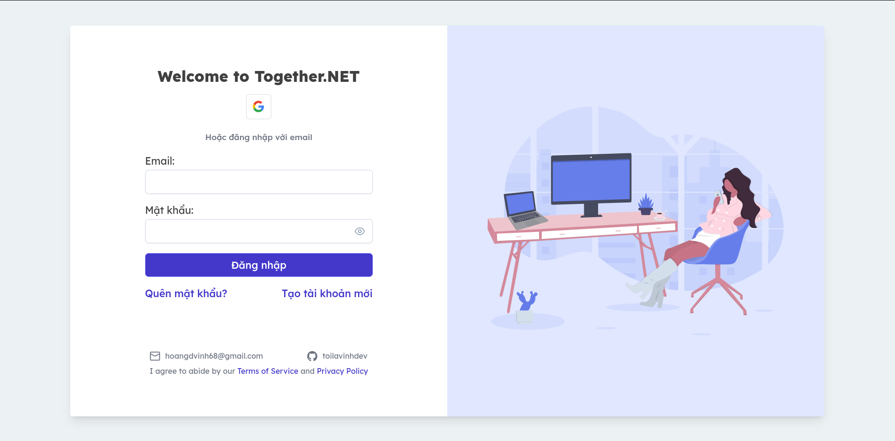

# Together.NET.v2

[togethernet.asia](https://togethernet.asia)

## Technologies

#### Backend
- C# .NET 8
- PostgreSQL
- Redis
- WebSocket
- Nginx
- Docker

#### Frontend
- Angular 17
- TypeScript, HTML, SCSS
- PrimeNG 17
- TailwindCSS
- Chart.js, Quill

### IDE & Text Editor
- Jetbrains Rider
- Jetbrains DataGrip
- Neovim

## Setup
> docker-compose -f Together.Docker/docker-compose.env.yml up -d

## Overviews
- Dockerize project and deloy production on Ubuntu Server 22.04 (VPS)

- Setup Nginx Reverse Proxy Server

- OAuth(Google) authentication support

- Send mail forgot password

- Dynamic authorization - Role-Based Access Control (RBAC)

- Realtime Chat and Notifications

- Implement CQRS Pattern with MediatR

- Logging using Serilog Discord Web Hook

- Supports Vietnamese & English for API and Client

- More...